文章遷移前的發佈網址 (巴哈姆特): https://forum.gamer.com.tw/C.php?bsn=18601&snA=7758

---

osu!lazer 比賽模式 (Tournament Mode) 為現在 osu! World Cup (OWC) 官方直播所使用的客戶端，並透過 [IPC](https://zh.wikipedia.org/wiki/行程間通訊) 方式和 [osu!tourney (osu! 比賽模式)](https://osu.ppy.sh/help/wiki/osu!tourney) 進行資料連結 (例如: 分數、比賽房間聊天室等...)。

同時也可配合使用第三方比賽房間管理軟體 [Script chan (又稱為 osu!tournament)](https://git.cartooncraft.fr/shARPII/script-chan/wikis/About-us/Home)  管理房間。

先決條件:
- 已安裝 osu! (Cutting Edge 版本)，並登入帳號 (去官網下載，就是平常在用的 osu! 客戶端，然後進遊戲切換版本即可)
- 已安裝 osu!lazer，並登入帳號 (去這裡下載: https://github.com/ppy/osu/releases)
- 擁有 osu!supporter tag (才能啟動 osu!tourney)

## 如何進入 osu!lazer 比賽模式客戶端

步驟:
1. 在桌面的 osu!lazer 捷徑上按右鍵，點「內容」

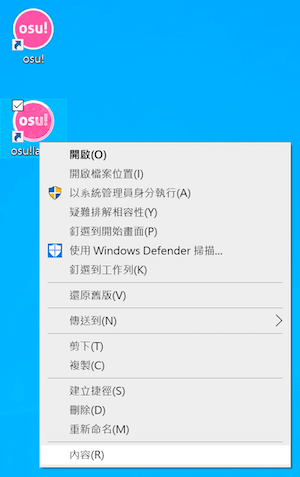

2. 在目標的最後面加入 `--tournament`，並按確定

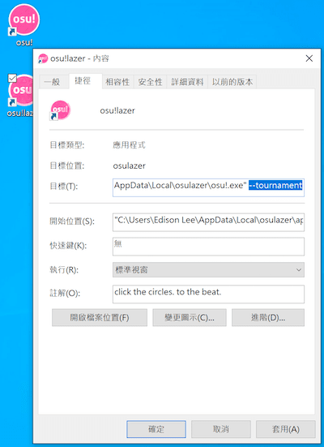

3. 點兩下 osu!lazer 的捷徑

4. 會看到這樣的介面，代表已經進入 osu!lazer 比賽模式

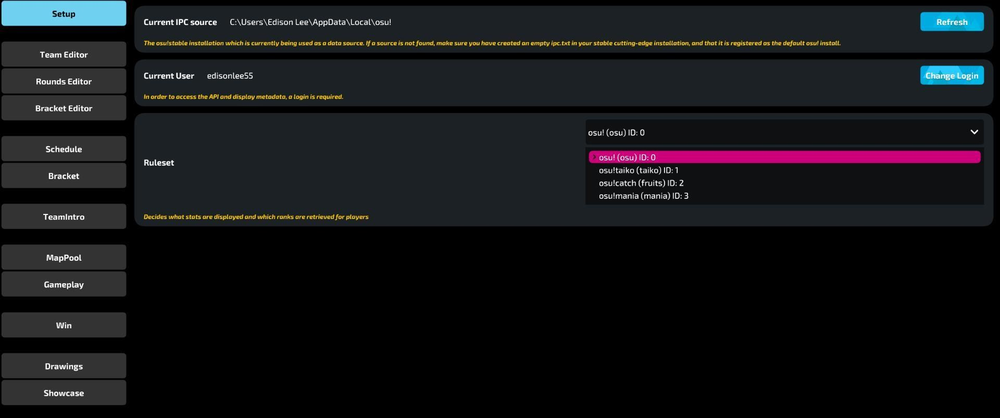

## osu!tourney 及 IPC 設定

**打開 osu!lazer 比賽模式之後還要打開 osu!tourney 並設定 IPC 才能做資料連結，以下是 osu!tourney 的設定方式**

1. 打開 osu!，然後將版本換成 Cutting Edge (好像翻作最新版...)，然後重啟並更新

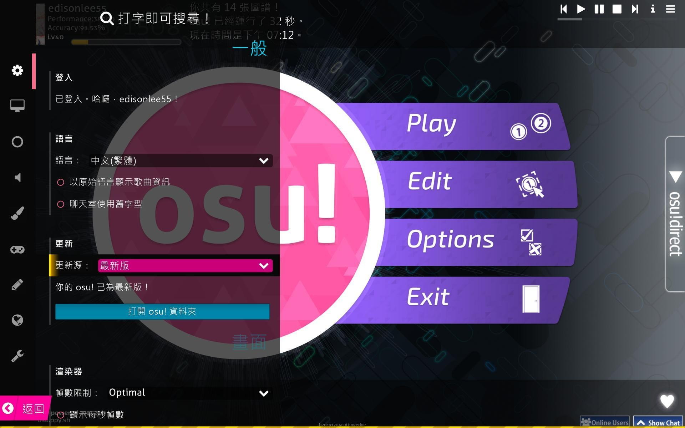

2. 接著退出遊戲，到 osu! 的安裝資料夾 (如果沒有特別更改，通常在 `C:\Users\<用戶名稱>\AppData\Local\osu!`)

3. 新增 `ipc.txt` 和 `tournament.cfg` 這兩個空白文件 (副檔名請注意，可以打開副檔名檢視直接改副檔名比較快)

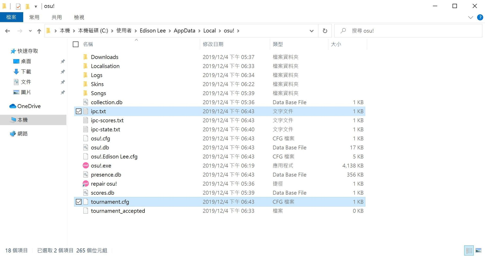

4. 打開 osu! 後就會進入 osu!tourney 比賽模式，然後就會看到類似這樣的介面 (其餘設定可參照 osu! 官方文件: https://osu.ppy.sh/help/wiki/osu%21tourney)

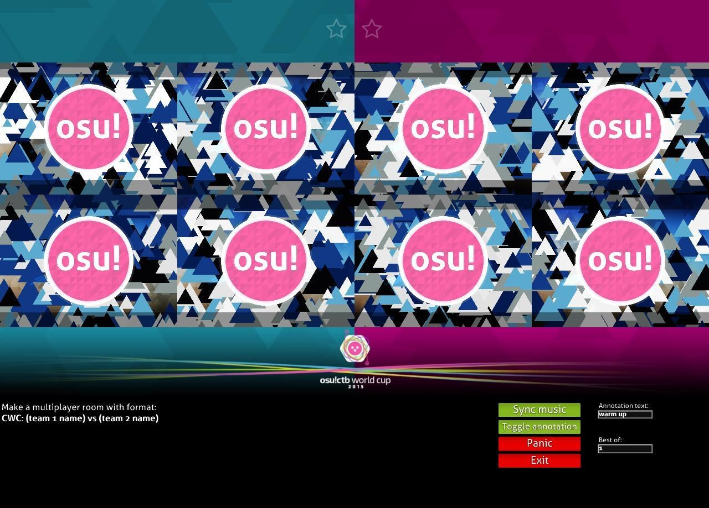

## osu!lazer 比賽模式概略介紹

### Setup (設定)

有這些設定:
- IPC 連接確認 (如果顯示 Not Found，請檢查第二部分是否操作正確)
- osu! 帳號登入 (如果還沒登入請按 Change Login 登入，需要 osu! 帳號才能正確獲得圖譜等資料)
- 模式選擇

### Team Editor (隊伍編輯器)

主要用來整理隊伍跟成員。

右邊的 Control Panel:
- Add new: 新增隊伍
- Clear all: 刪除全部隊伍
- Add all countries: 把全部國家的名稱當成隊名都加進去

中間的隊伍:
- Name: 隊伍全名
- Acronym: 隊伍縮寫 (會顯示在後面的賽程表和天梯圖)
- Flag: 隊伍國旗 (用國家代號)
- Add player: 新增玩家的 ID 到隊伍
- Delete Team: 刪除該隊伍

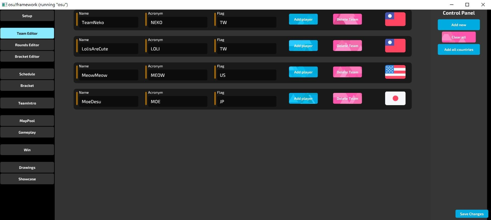

### Rounds Editor (回合編輯器)

用來整理回合和圖池。

右邊的 Control Panel:
- Add new: 新增回合
- Clear all: 刪除全部回合

中間的回合:
- Name: 回合名
- Description: 回合解釋
- Start Time: 該回合的開始時間
- Best of: 賽制數量
- Add beatmap: 新增圖譜到圖池
- Beatmap ID: 圖譜 ID  
(像是圖譜 https://osu.ppy.sh/beatmapsets/813454#osu/1706017 的 ID 就是 `1706017`，取最後的數字)
- Mods: 使用的 Mods  
(需自行於 `C:\Users\<用戶名稱>\AppData\Roaming\osu` 中建立 `mods` 資料夾，並將各個 mods 的圖案放到該資料夾當中，最後在這邊輸入檔案名稱即可 (不需副檔名)，檔名可自取。圖案可以直接用 skin 當中的 mods 圖案，也可以自行設計)
- Delete Beatmap: 將該圖譜從圖池刪除
- Delete Round: 刪除該回合

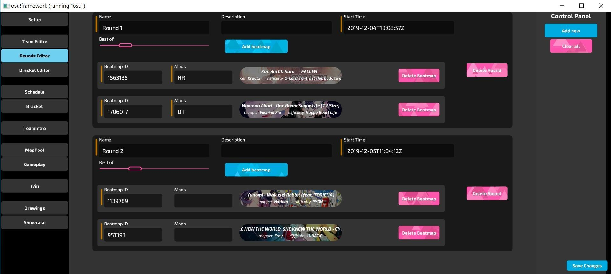

### Bracket Editor (賽程天梯編輯器)

用來整理賽程比分的天梯圖，在空白處按右鍵來新增對戰，在對戰上按右鍵來設定目前進行中的對戰並連結其他對戰。

右邊的 Ladder:
- Team 1: 該對戰的隊伍 1
- Team 2: 該對戰的隊伍 2
- Round: 該對戰是屬於哪個回合 (和剛剛在 Rounds Editor 中所設定的做對應)
- Losers Bracket: 該對戰是否為敗部賽
- Match Time: 對戰進行的時間

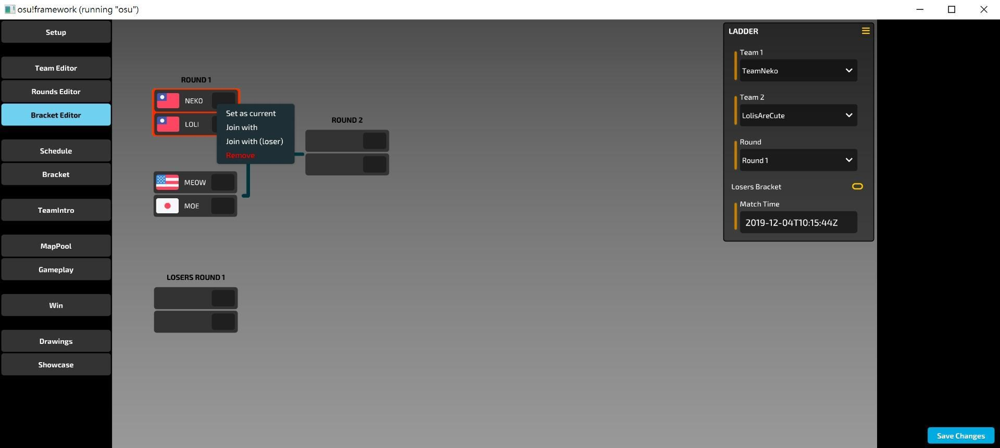

### Schedule (自動生成的賽程表)

從上面設定好的資料中自動生成的賽程表，可用於 OBS 直播。

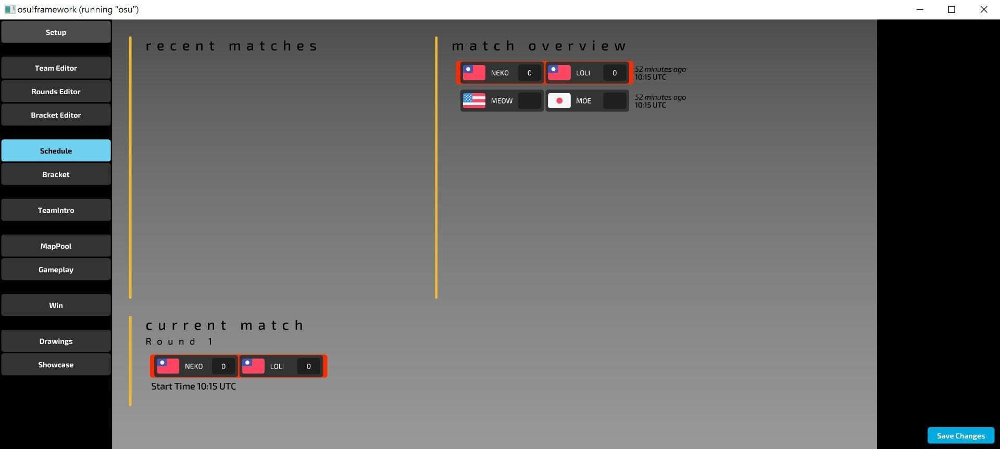

### Bracket (賽程天梯圖)

從賽程天梯編輯器設定好的天梯圖，可用於 OBS 直播，並在上面編輯比分。

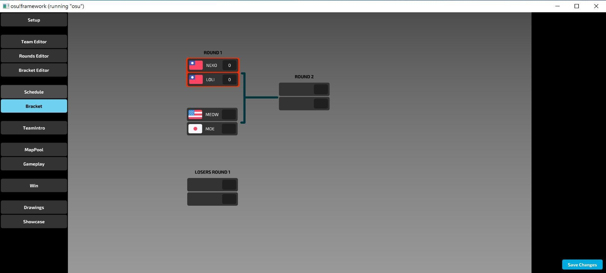

### TeamIntro (比賽開始前的隊伍介紹)

從上面設定好的資料中自動生成的隊伍介紹圖，可用於 OBS 直播。

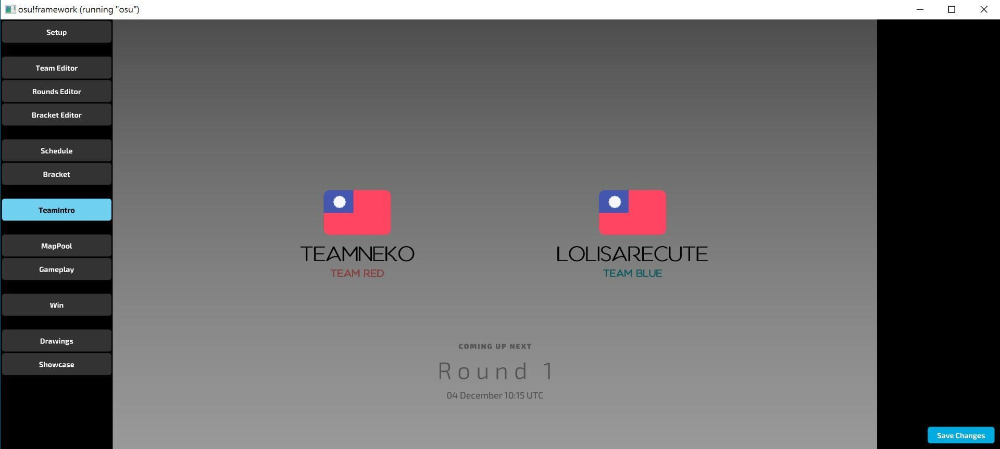

### MapPool (圖池)

從上面設定好的資料中自動生成的圖池，可用於 OBS 直播，並做 Pick/Ban 圖的功能，下面同時同步比賽房間聊天室內容。

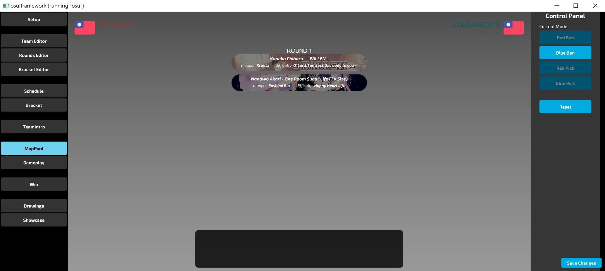

### Gameplay (比賽時遊戲介面)

以 IPC 和 osu!tourney 即時同步分數和目前圖譜，擁有綠布幕可將本介面和 osu!tourney 的畫面合成到 OBS 直播中，下面同時同步比賽房間聊天室內容。

右邊的 Control Panel:
- Toggle warmup: 熱身賽開關
- Toggle chat: 比賽房間聊天室開關

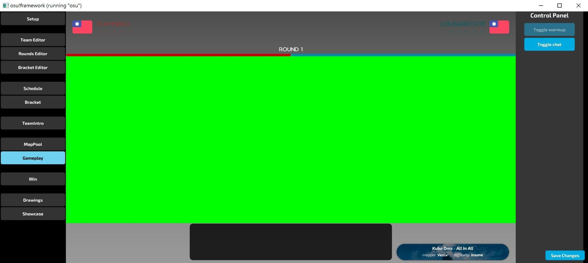

### Win (該回勝利的隊伍圖)

### Drawings (抽籤介面)

osu!Lazer Drawing 抽籤系統。

須先設定，可參照 osu! 官方文件: https://osu.ppy.sh/help/wiki/Tournament_Drawings

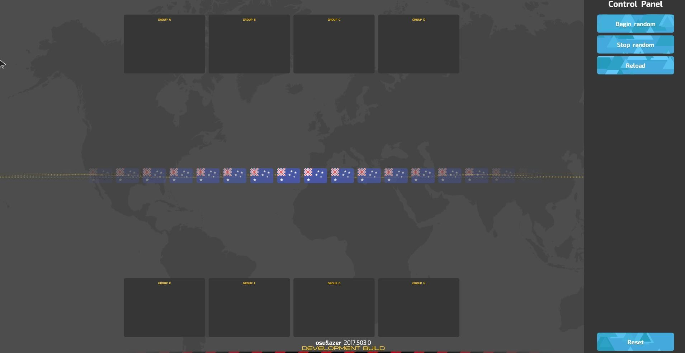

### Showcase (圖譜詳細資料顯示)

顯示圖譜的詳細資料，可自行於 OBS 中合成其他物件。

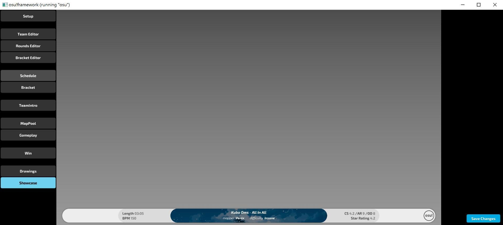
