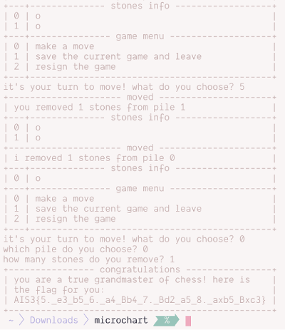
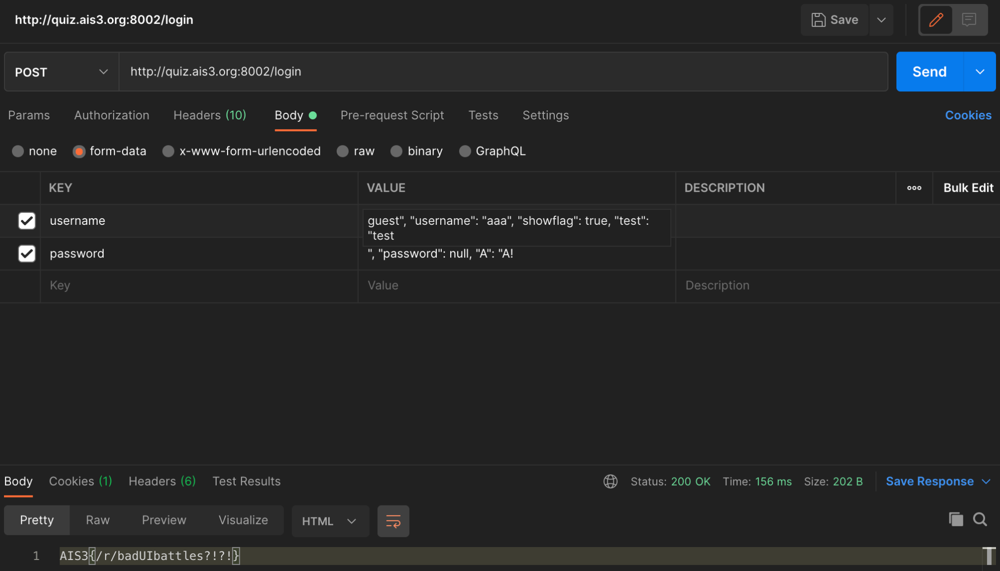
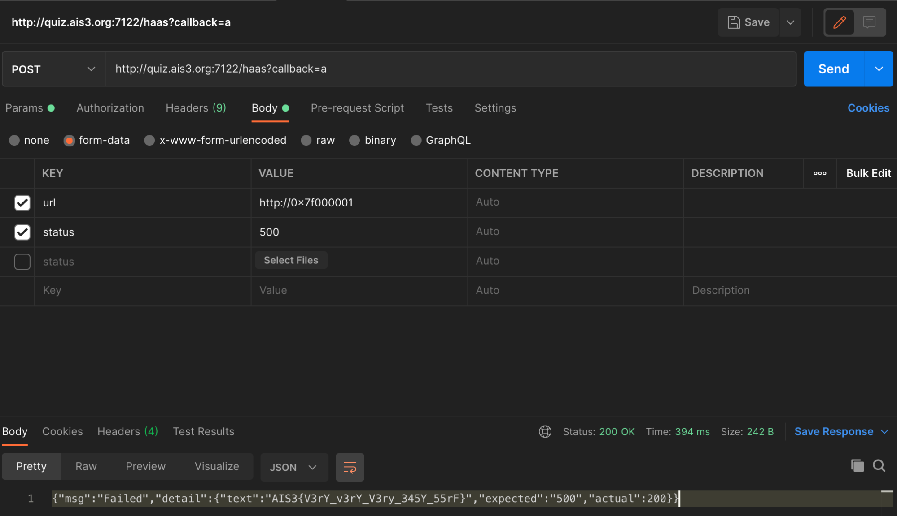

題目我忘記存到哪裡了... 總之就是之前紀錄的解題過程 ouo

隊名叫做: 白上吹雪好可愛 (小易貓貓去女裝)

www

---

## ReSident evil villAge

Forgery Attack Against RSA Digital Signature  
Reference (p.9): http://www.ccs.neu.edu/home/riccardo/courses/csg252-fa06/lecture6.pdf

"Ethan Winters" → 5502769663009776377079720669811

```{linenos=false}
Existential forgery using a known-message attack:

Suppose y = sig(x) and y’ = sig(x’)
Can check e(y y’ mod n) = x x’ mod n
So y y’ mod n = sig(x x’ mod n)
```

因此根據公式，先分解出兩組數字:  
33759323085949548325642458097 * 163 = 5502769663009776377079720669811

33759323085949548325642458097 → 0x6D150EBB92427FDC8E1053F1  
163 → 0xA3

將 6D150EBB92427FDC8E1053F1 和 A3 分別 sign 之後，將兩組 signature 乘起來丟進去 verify，拿到 Flag。

Flag: `AIS3{R3M383R_70_HAsh_7h3_M3Ssa93_83F0r3_S19N1N9}`

## Cat Slayer ᶠᵃᵏᵉ | Nekogoroshi

數字密碼暴力破解，配暮蟬 BGM 棒 (=ﾟωﾟ)ﾉ

密碼: 2025830455298

Flag: `AIS3{H1n4m1z4w4_Sh0k0gun}`

## Microcheese

就...程式有 bug，在剩下倒數兩顆的時候，按 0~2 以外的按鍵，就會讓 AI 方強制下棋，然後就贏惹ww



Flag: `AIS3{5._e3_b5_6._a4_Bb4_7._Bd2_a5_8._axb5_Bxc3}`

## ⲩⲉⲧ ⲁⲛⲟⲧⲏⲉꞅ 𝓵ⲟ𝓰ⲓⲛ ⲣⲁ𝓰ⲉ

Python Server Side Injection  
想辦法把資料塞進去然後覆蓋就對了，我試了好久總算成功 ಥ_ಥ

越後面的 key 值就會蓋過前面的 key 值，然後 password 如果是 null 就會被 Python 解析成 None。

username: `guest", "username": "aaa", "showflag": true, "test": "test`  
password: `", "password": null, "A": "A!`



Flag: `AIS3{/r/badUIbattles?!?!}`

## HaaS

亂玩之後發現存取到 `http://localhost` 會說 Don’t Attack Server，看來存取 localhost 就會拿到 flag。

但因為輸入 `localhost`, `127.0.0.1` 這類常見的會被系統擋  
所以得用這種奇怪的 OwO (同樣也是連到 localhost): `http://0x7f000001`

接著把 status 換成 200 以外的就行惹。



Flag: `AIS3{V3rY_v3rY_V3ry_345Y_55rF}`

## [震撼彈] AIS3 官網疑遭駭！

先觀察 pcap 檔案發現有兩組 HTTP 請求都是到 10.153.11.126

http://magic.ais3.org/index.php?page=bHMgLg%3d  
http://magic.ais3.org:8100/Index.php?page=%3DogLgMHb  
(第二組只有請求一次，所以藏在一堆請求的中間，好壞 QwQ)

接著繼續觀察 pcap 發現  
請求 quiz.ais3.org 的 DNS A record 是 10.153.11.126

如果直接通 quiz.ais3.org:8100 是不會通的，但卻有上面兩組 HTTP 請求  
所以代表 server 是看 header 的 Host 來決定通不通，把 Host 換成 magic.ais3.org 之後就通了。

接著觀察 index.php (小寫的) 的 query string "page"，會發現那東西一副就是要拿去解碼 Base64 (草)  
所以把 `bHMgLg%3d` 解碼後得到 `ls .`，這東西看起來則是一副系統指令的樣子。

然後觀察 Index.php (大寫的) 的 query string，發現就是上面小寫版的 reverse `%3DogLgMHb`  
所以可以猜測如果要跑系統指令得先把指令變成 Base64 之後，再把它 reverse，最後放到 query string 裡面。

把 page query string 拿掉，會看到 PHP 丟 system 指令錯誤，發現 query string: page 可以被注入 PHP system 指令。

接著照上面的推論，嘗試執行 `ls ..`，編碼後並反轉的字串是 `=4iLgMHb`，看到了根目錄:
```{linenos=false}
bin boot dev etc flag_c603222fc7a23ee4ae2d59c8eb2ba84d home lib lib64 media mnt opt proc root run sbin srv sys tmp usr var webroot
```

`flag_c603222fc7a23ee4ae2d59c8eb2ba84d` 一副 flag 樣  
所以我們一樣編碼並反轉 `cat ../flag_c603222fc7a23ee4ae2d59c8eb2ba84d` 得到 `=QGN4EmYyIWZ4MWO1QmMlFGNlV2MyE2NjZmMyIzMwYzYfdWYsZ2Lu4CI0F2Y` 放入 query string，拿到 flag。

Flag: `AIS3{0h!Why_do_U_kn0w_this_sh3ll1!1l!}`

## Microchip

觀察 code 然後反做一遍，把字串中每四個字元分成一組後每組都 reverse，接著再把四組 key 找出來，寫個小程式反解回去就行惹。

Flag: `AIS3{w31c0me_t0_AIS3_cryptoO0O0o0Ooo0}`

## Piano

> 解出來但是 Flag 沒上傳到啊啊啊，因為彈窗的字沒辦法複製，比賽剩下 30 秒，然後就差一題進前 75 名，殘念 QwQ

先觀察一下程式檔案，發現是用 .NET 開發的！廢話不多說，直接把 dll 丟進 Rider 反編譯，程式碼輕鬆出來 OuO

Piano.cs 是程式的主要蘿莉...(等等我怎打蘿莉) 邏輯部分，先觀察一下 Piano constructor，知道了按鍵有 14 個，然後照音名順序排列，接著繼續觀察程式碼，看到有一組 nya function，反正跟貓貓有關的絕對是答案！

所以查了 usage 在 79 行，77 行有個判斷式 `isValid`，所以得想把法讓 `isValid == true`，我們才能呼叫貓貓 function。

接著開始觀察 isValid function，發現有四組 list，同樣的 list 各有兩組，但實際上看 `intList2` / `intList4` 這兩組就行了，因為最下面的判斷式只看這兩組，觀察一下判斷式，想把法把數字湊出來滿足條件即可:
```{linenos=false}
7, 7, 10, 10, 11, 11, 10, 9, 9, 3, 3, 8, 8, 7, 7
```

我們知道按鍵是照音名順序排列的，所以就在鋼琴按鍵上面依照對應的按鍵彈即可拿到 Flag。

Flag: `AIS3{7wink1e_tw1nkl3_l1ttl3_574r_1n_C_5h4rp}`

---

喔不，窩是個 DD，因為阿夸也好可愛 (●°u°●)​ 」


